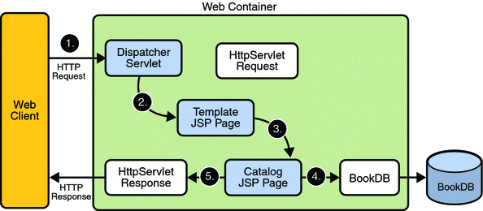

# simple-servlet

A simple example of a Java servlet and a JSP. 


## Servlets

Java servlets are compiled Java classes that implement all or part of a web application. They are not standalone Java programs but must be run by a suitable web server.  Though this might seem complicated it actually makes creating and deploying web based applications easier.



## Java Servlet Pages (JSP)

JSP is a document format combining HTML and Java to create "dynamic" web pages. These pages are delivered by the web server to the client as HTML, but first the Java code is run to replace variables with actual values.  For example a JSP web page might look up order details from a database and insert the results in an HTML table. 

If you've used PHP or ASPnet then you will see some strong similarities, at least in the approach to creating web content.

Servlets are usually packaged as ``WAR`` (web archive) files. Like a zip, jar or other archive these files contain a directory structure and multiple files that make up the web application.  Typically there will be .class, .jsp, and .html files. There will also be a web.xml file that describes the mapping of URLs to servlets.

## Running the servlet

To run the servlet build the war file, then deploy using Jetty or Tomcat.

To build the servlet we build the ```package``` target using Maven.  From the command line the command is -

```mvn package```

Which will compile and then package.

Or you could select this from the ```Maven Projects``` in VS Code `Explorer` view.

There are many ways test and run servlets, here are some suggestions.

1. From the command line.

   * Download Jetty from http://www.eclipse.org/jetty/download.html

   * Unzip the downloaded file

   * Copy the WAR file into the ``webapps`` folder

   * In the ``jetty-distribution`` folder, start Jetty with the command

   ```java -jar start.jar```

   * Open the webpage http://localhost:8080

   For more information see
   http://www.eclipse.org/jetty/documentation/9.4.x/quickstart-running-jetty.html


1. As a Maven build.

    The ``Jetty plugin`` is included in this example's ```pom.xml``` enabling Jetty to be installed and started automatically via Maven.  
    
    * Use this command:

        ```mvn jetty:run```

    For more information see https://www.eclipse.org/jetty/documentation/9.4.x/maven-and-jetty.html 

1. Using the VS Code Jetty extension.

    * Install the ``Jetty for Java`` extension. (Reload to enable)

    * Add a Jetty server, select the folder you unzipped to

    * Click right on the .war file in the VS Code Explorer view, 
    choose ```Run on Jetty Server``` 

1. Using Tomcat.

Tomcat includes a web interface for managing the web server. You can use this to upload WAR files into the server, and other configuration tasks.  You might also wish to install the ``Tomcat for Java`` VS Code extension.


